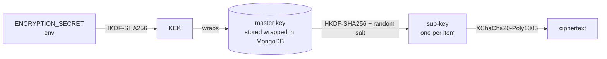

# example3: envelope encryption on MongoDB

`example3` is a small gorest app that encrypts text, numbers and files, with
MongoDB as its only database. It shows **envelope encryption**: one master key
protects all the data, and that master key is itself encrypted with a secret
from the environment.

It follows the same layered, interface-driven shape as
[`example2`](../example2) (handler → service → repo). The crypto comes from
[`github.com/pilinux/crypt/envelope`](https://github.com/pilinux/crypt)
(v0.0.29+); example3 adds the key lifecycle, file storage and the HTTP API.

## How the keys fit together



- **KEK.** Derived from `ENCRYPTION_SECRET` (at least 32 characters). Its only
  job is to wrap and unwrap the master key, so it is wiped from memory once the
  app has booted.
- **Master key.** 32 random bytes, created on first boot and stored in MongoDB,
  wrapped by the KEK. It is unwrapped once at boot and kept in memory.
- **Sub-key.** Every text, number and file gets its own key, derived from the
  master key and a fresh 16-byte salt. The salt is stored next to the
  ciphertext so the same key can be derived again. No two items share a key.
- **Pinned labels.** The HKDF labels in `internal/service/scheme.go` must never
  change. Changing them makes every stored item impossible to decrypt.
- **Exactly one master key.** A unique index on `keyName` is created at boot,
  before the key is loaded. If two instances start at the same moment, the
  second insert fails and that instance loads the key the first one wrote.

### Rotating the secret

1. Move the current `ENCRYPTION_SECRET` value to `ENCRYPTION_SECRET_OLD`.
2. Set `ENCRYPTION_SECRET` to the new secret.
3. Restart. The stored master key no longer opens with the new secret, so the
   app opens it with the old one and re-wraps it with the new one.
4. Once every instance has restarted, remove `ENCRYPTION_SECRET_OLD`.

The master key itself never changes, so no data has to be re-encrypted.

## Text and numbers

Each value is sealed in one go into a small envelope and returned as a base64
token:

```text
version (0x01) | saltLen | salt | 24-byte nonce | ciphertext + tag
```

A text token gives away the length of the text: it is always 58 bytes longer.
Numbers are always encoded as 8 bytes, so every number token is the same length.

## Files

Files differ from text in three ways.

**Streamed.** A file is encrypted 1 MiB at a time on the way in and decrypted
1 MiB at a time on the way out. Memory use stays small however big the file is,
and plaintext is never written to disk.

**Padded.** Before encryption, the file is padded with zeros up to a Padmé size
bucket, so its size on disk no longer shows its exact length. These three files
all end up the same size:

| Original size | Size on disk |
| ------------: | -----------: |
|        94,500 |       96,309 |
|        96,037 |       96,309 |
|        96,200 |       96,309 |

The overhead is at most about 12%, and about 3% on average. Padding hides small
differences, not big ones: a 90 KB file still looks different from a 970 KB one.

**Tied to its record.** The file id is bound into every chunk, so a `.enc` file
copied under another id no longer opens. The MongoDB record keeps the file's
name, real size and SHA-256; the size and SHA-256 are checked again on download.

### Two ways to upload

Padding needs the file's length, and that length is stored in the first chunk
(chunk 0). How the app learns the length depends on how the file is sent:

| Upload                                                  | Length comes from           | Result                                     |
| ------------------------------------------------------- | --------------------------- | ------------------------------------------ |
| `application/octet-stream` (the file is the whole body) | the `Content-Length` header | written in order                           |
| `multipart/form-data` (a normal form post)              | counting as it streams in   | chunk 0 is held in memory and written last |

Either way the upload is read only once, and the file on disk is the same. A
form post just costs one extra 1 MiB chunk of memory. Writing chunk 0 last
works because the app writes straight into the stored file, which can be
written at any offset.

### Without padding

`POST /api/v1/crypto/files/encrypt/unpadded` stores the same kind of stream
without padding. It needs no length and always writes in order, but the file
size on disk then shows the real length almost exactly.

The record's `unpadded` flag tells the download which reader to use. Changing
the flag can't trick the app: each format is bound to its own tag, so the wrong
reader simply fails.

### What gets checked

- Chunks can't be reordered, duplicated or dropped, and a cut-off file is never
  mistaken for a complete one.
- A forged file header can't make a download allocate a huge buffer: chunk
  sizes over 1 MiB are refused before any memory is allocated.
- After the last chunk, the size and SHA-256 are compared with the record.
- A padded file has its first chunk checked before the response starts, so a
  wrong key or a bad file is a clean `500`.
- Damage further in, or any problem with an unpadded file, is only found after
  `200 OK` is sent. The download then stops short of its `Content-Length`, so
  the client knows the file is incomplete.

### Upload limits

- `MAX_UPLOAD_SIZE_MB` is enforced while the file streams in. Going over it
  returns `413`, and the partial file is removed.
- A raw upload whose `Content-Length` is over the limit is refused before
  anything is read. One whose body doesn't match its `Content-Length` gets `400`,
  and so does any upload cut off mid-stream.
- A form post's whole body is capped at the limit plus 1 MiB for headers and
  other form fields.

## Endpoints

| Method | Path                                    | Description                              |
| ------ | --------------------------------------- | ---------------------------------------- |
| GET    | `/` and `/health`                       | liveness check                           |
| POST   | `/api/v1/crypto/text/encrypt`           | encrypt a string → base64 token          |
| POST   | `/api/v1/crypto/text/decrypt`           | decrypt a token → string                 |
| POST   | `/api/v1/crypto/number/encrypt`         | encrypt an integer → base64 token        |
| POST   | `/api/v1/crypto/number/decrypt`         | decrypt a token → integer                |
| POST   | `/api/v1/crypto/files/encrypt`          | upload a file, stored padded             |
| POST   | `/api/v1/crypto/files/encrypt/unpadded` | upload a file, stored unpadded           |
| GET    | `/api/v1/crypto/files/:id/decrypt`      | download the original file               |
| DELETE | `/api/v1/crypto/files/:id`              | delete the encrypted file and its record |

Both file upload routes accept:

- **`multipart/form-data`**, with the file in the `file` field. Other form
  fields may come along.
- **`application/octet-stream`**, with the file as the whole body. Name it with
  a `?name=` query parameter or a `Content-Disposition` header; otherwise it is
  stored as `file`.

One decrypt route and one delete route serve both formats. A download returns
the raw bytes as an attachment, with the original size as `Content-Length`.

## Layout

```text
example3/
├── cmd/app/
│   ├── .env.sample        # configuration template
│   └── main.go            # startup: config → MongoDB → indexes → load key → serve
└── internal/
    ├── database/model/    # MongoDB documents and request/response bodies
    ├── repo/              # MongoDB access for the key and file records
    │   └── index.go       # unique indexes, created before the key is loaded
    ├── service/           # key manager, text and file encryption
    │   ├── scheme.go      # pinned HKDF labels and chunk sizes
    │   └── storage.go     # file ids, size limit, sealing files to disk
    ├── handler/           # HTTP handlers
    └── router/            # routes
```

## Run it

1. Copy the sample env, then set a strong `ENCRYPTION_SECRET` (32+ characters)
   and point `MONGO_URI` at your MongoDB. `ENCRYPTED_FILES_DIR`,
   `MAX_UPLOAD_SIZE_MB` and `APP_PORT` (8999) are already set in the sample.
   To report server-side errors, set `ACTIVATE_SENTRY=yes` and your `SentryDSN`.

   ```bash
   cp example3/cmd/app/.env.sample example3/cmd/app/.env
   ```

2. Start the server:

   ```bash
   cd example3/cmd/app
   go run .
   ```

### Example requests

```bash
# text
curl -s -XPOST localhost:8999/api/v1/crypto/text/encrypt \
  -H 'Content-Type: application/json' -d '{"plaintext":"hello world"}'
# => {"message":{"ciphertext":"AQ...=="}}

curl -s -XPOST localhost:8999/api/v1/crypto/text/decrypt \
  -H 'Content-Type: application/json' -d '{"ciphertext":"AQ...=="}'
# => {"message":{"plaintext":"hello world"}}

# number
curl -s -XPOST localhost:8999/api/v1/crypto/number/encrypt \
  -H 'Content-Type: application/json' -d '{"number":42}'

# file, as a form post
curl -s -XPOST localhost:8999/api/v1/crypto/files/encrypt -F file=@/path/to/doc.pdf
# => {"message":{"id":"...","fileId":"<id>","name":"doc.pdf","size":12345,...}}

# file, as a raw body
curl -s -XPOST 'localhost:8999/api/v1/crypto/files/encrypt?name=doc.pdf' \
  -H 'Content-Type: application/octet-stream' --data-binary @/path/to/doc.pdf

# file, without padding
curl -s -XPOST localhost:8999/api/v1/crypto/files/encrypt/unpadded -F file=@/path/to/doc.pdf
# => {"message":{...,"size":12345,"unpadded":true,...}}

# download the original
curl -s localhost:8999/api/v1/crypto/files/<id>/decrypt -o doc.pdf

# delete
curl -s -XDELETE localhost:8999/api/v1/crypto/files/<id>
```

## Test

```bash
go test -v -cover ./example3/...
```

No MongoDB or env vars needed: the tests use in-memory fakes of the database.
